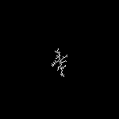

# Aggregating-Model
Implementation of Diffusion Limited Aggregating model from the [paper](http://paulbourke.net/fractals/dla/) written by Written By Paul Bourke.

The [notebook](DLA2d.ipynb) has a simulation to the DLA model and a regression model (a hypothetical model) to estimate the stickiness parameter.

A simulation using the algorithm.

| Parameter   |           |
|-------------|-----------|
| Matrix      | 150 X 150 |
| Points used | 100       |
| Stickiness  | 1         |

